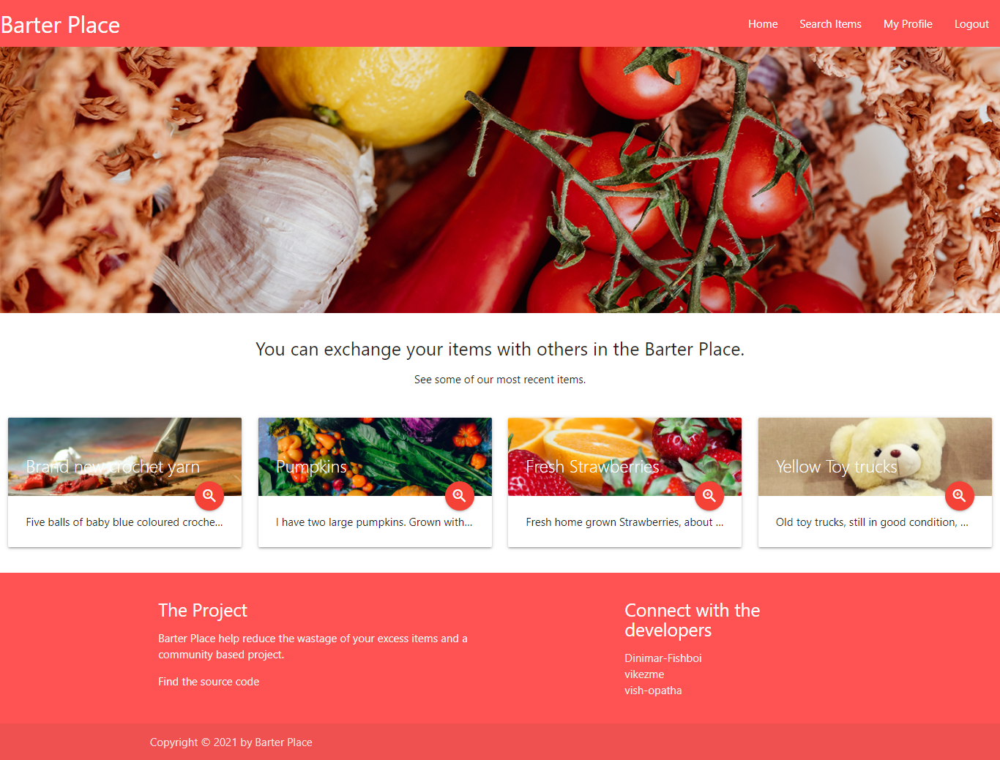
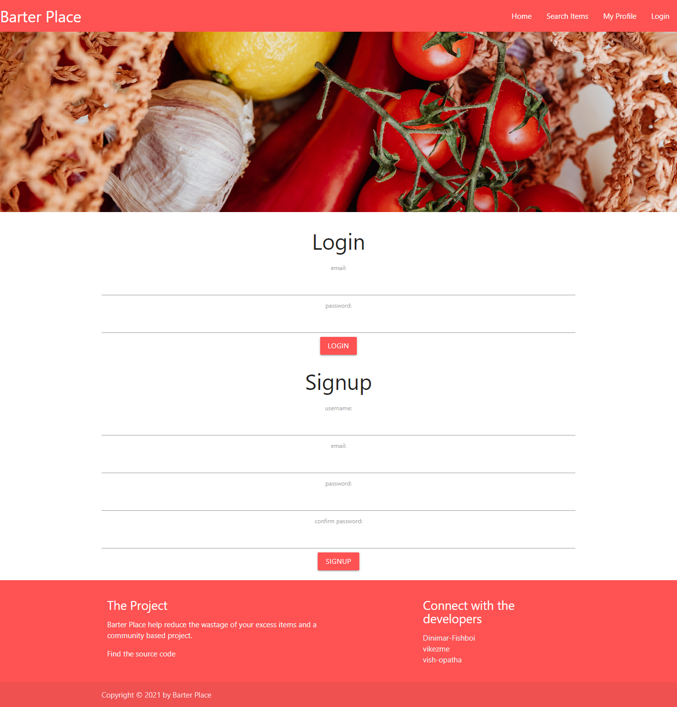
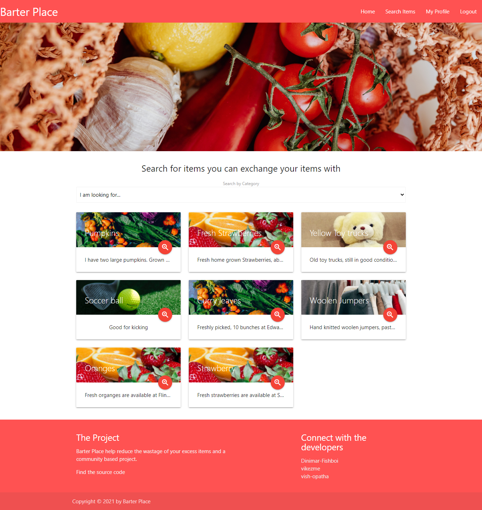
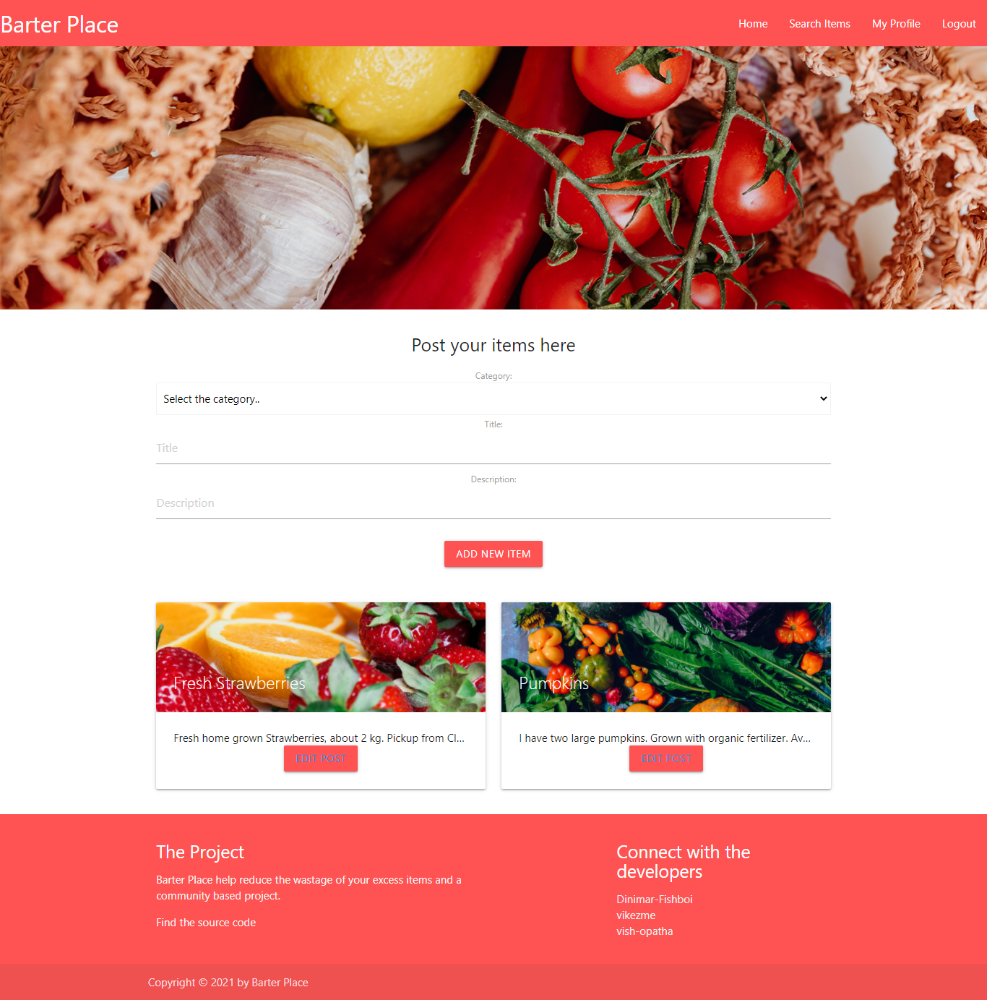
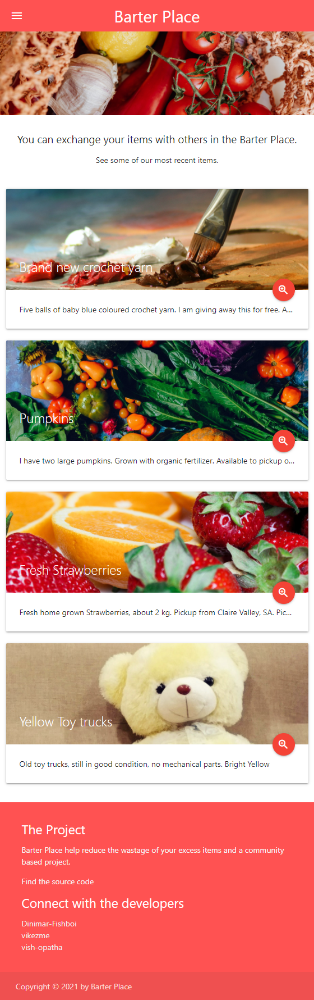

# Barter Place

  [](https://opensource.org/licenses/MIT)
     
  ## Description
  Barter Place is a full stack web application which is developed using several full stack technologies. It helps reduce the wastage of excess items that people may have, and provides a platform to exchange them within other people who are interested of those goods. This project is developed based on **Model View Controller (MVC)** paradigm. This project has its **own API**, and operates with **user authentication** when required. This web application designed and developed in a way that it is **fully reponsive** on all sorts of devices.

  The project has used several technologies and tools. With regards to the languages and technologies following were used; **HTML, Materialize CSS framework, Javascript, Node js, Express Handlebars, Express Session, MySQL2,Dot.env, Bcrypt,Sequelize and Object Relation Mappting(ORM).**

  Apart from that server side API was tested using **Insomnia Core** before it is integrated to the front end of the application.  
  ## Table of Contents
  * [Important Links](#Important-Links)
  * [User Story](#User-Story)
  * [Design](#Design)
  * [Installation](#Installation)
  * [Usage](#Usage)
  * [Contribute](#Contributing)
  * [Meet the Developers](#Meet-the-Developers)
  
  ## Important Links
  Following are the important links related to this application.
  * [Barter Place - Heroku Deployment](https://project2t3.herokuapp.com/)
  * [Barter Place- Github Repo](https://github.com/Dinimar-Fishboi/Project_2_team3)
  ## User Story
  * When I go to Barter Place, the home page will come up with the most recent 4 items on the site.
  * When I go to the search page and request for a specific category all items belonging to that category will display  on the page.
  * When I click on a particular item, I can view all the details of the item and contact the person who posted that item via an email.
  * When I try to post an item on Barter Place, if I am not logged in I will be redirected to a login/signup page.
  * If I have logged in before, I can use my email and password to log in again.
  * If I am a new user, I can create an account by adding my Username, Email and Password.
  * If I want to edit or delete the item posted - then I can do so on the userProfile page.
  * If I want to view the web application on my phone, the application is fully responsive and adapts according to the device specification.
  ## Design
  Following images shows the final design of the application.

  *Home page*

  

  *Login Page*

  

  *Search Page*
  

  *User Profile Page*
  


  *Mobile View
  
  ## Installation
  If you expect to run this project in your local computer, first you need to install the necessary dependencies. Please run the following command for that after cloning the project to your local machine

  ```
  npm install 
  ```
  Then you need to create .env file and update the following according to your local settings.


    DB_USER=your username
    DB_PASSWORD=your password
    DB_NAME=database name 
  
  ## Usage
  After completing the stepts in the "Installation" section, run the project in your local machine, by using the following command.

  ```
  node server.js 
  ```

  If you want to use the live version, please see the link in the "Important Links" section.
  ## Contributing
  You can contribute to this project by opening an issue in the github repo. Your contribution can help improve the functionality of the existing project. 

  ## Meet the Developers 
  If you have any questions regarding this project, contact the developers via github. You can find our other work at [Dinimar-Fishboi Github](https://github.com/Dinimar-Fishboi), [vikezme Github](https://github.com/vikezme) and [vish-op Github](https://github.com/vish-op)

  ## License and Copyright

 © Vish Opatha, Vikrant Kumar, Dinimar Fish, 2021

  Licensed under the [MIT License](LICENSE).